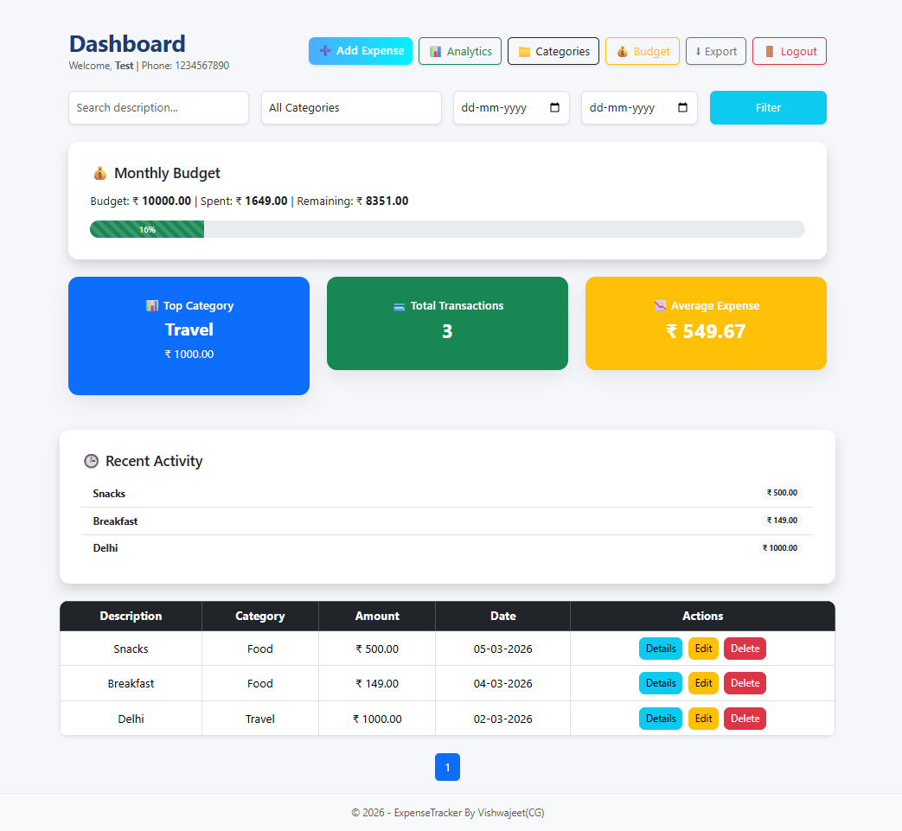
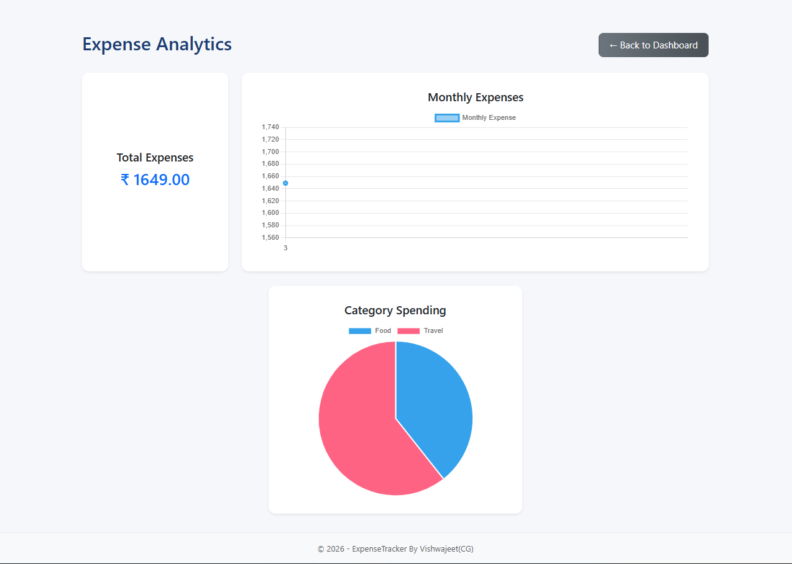
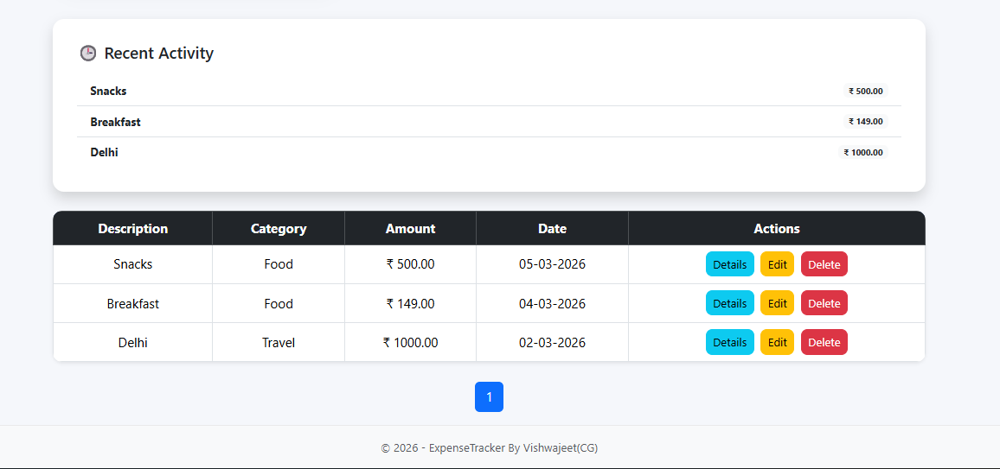

# 💰 Expense Tracker (ASP.NET Core MVC)


A **full-featured personal expense management web application** built with **ASP.NET Core MVC, Entity Framework Core, and SQL Server**.

The system allows users to **track expenses, manage categories, monitor monthly budgets, and analyze spending patterns** using interactive dashboards.

This project demonstrates **real-world full stack development concepts** including authentication, CRUD operations, filtering, pagination, analytics, and data export.

---

# 📸 Project Screenshots

### Dashboard


### Analytics


### Expense Management


---

# 🚀 Features

## 🔐 Authentication
- User Registration
- Secure Login
- Logout functionality
- Password hashing

---

## 💳 Expense Management
- Add new expenses
- Edit expenses
- Delete expenses
- View expense details
- Pagination for expense list

---

## 📂 Category Management
- Create categories
- Edit categories
- Organize expenses by category

---

## 📊 Dashboard Overview
The dashboard provides quick financial insights including:

- Monthly budget tracking
- Total transactions
- Average expense
- Top spending category
- Recent activity
- Expense history table

---

## 💰 Budget Tracking
Users can set a **monthly budget**.

Features include:
- Budget progress bar
- Remaining budget calculation
- Automatic **warning if spending exceeds 85%**

---

## 📈 Expense Analytics
Interactive visualizations including:

- Monthly expense trends
- Category-wise expense distribution
- Spending insights

Powered by **Chart.js**.

---

## 🔎 Search & Filtering
Users can filter expenses using:

- Description search
- Category filter
- Date range filter

---

## 📤 Export Data
Export expense data as **CSV file**.

```csv
Description,Category,Amount,Date
Food,Snacks,500,2026-03-05
Travel,Taxi,200,2026-03-04
```

---

# 🛠️ Tech Stack

## Backend
- ASP.NET Core MVC
- C#
- Entity Framework Core
- LINQ

## Frontend
- Razor Views
- Bootstrap 5
- Chart.js
- Custom CSS

## Database
- SQL Server

---

# 📁 Project Structure

```text
ExpenseTrackerUI
│
├── Controllers
│   ├── AuthController.cs
│   ├── ExpensesController.cs
│   └── CategoriesController.cs
│
├── Models
│   ├── User.cs
│   ├── Expense.cs
│   ├── Category.cs
│   └── Budget.cs
│
├── Data
│   └── AppDbContext.cs
│
├── DTOs
│   ├── ExpenseCreateDto.cs
│   └── ExpenseUpdateDto.cs
│
├── Views
│   ├── Auth
│   ├── Expenses
│   ├── Categories
│   └── Shared
│
├── wwwroot
│   ├── css
│   ├── js
│   └── lib
│
├── appsettings.json
├── Program.cs
└── README.md
```

---

# ⚙️ Installation & Setup

## 1️ Clone the Repository

```bash
git clone https://github.com/yourusername/ExpenseTracker.git
```

## 2️ Open the Project

Open the project in:

- Visual Studio
- VS Code

## 3️ Configure Database

Edit `appsettings.json`:

```json
"ConnectionStrings": {
  "DefaultConnection": "Server=localhost;Database=ExpenseTrackerDB;Trusted_Connection=True;TrustServerCertificate=True"
}
```

## 4️ Apply Database Migration

Run:

```bash
dotnet ef database update
```

## 5️ Run the Application

```bash
dotnet run
```

Open in browser:

`https://localhost:xxxx`

---

# 📊 Dashboard Highlights

The dashboard includes:

- ✔ Budget tracking
- ✔ Spending insights
- ✔ Recent activities
- ✔ Expense list with pagination
- ✔ Category-based analytics

---

# 🔮 Future Improvements

Possible future enhancements:

- Dark Mode UI
- Recurring expenses
- Email alerts for budget limits
- PDF report generation
- Mobile responsive design improvements
- Multi-user admin panel

---

# 📚 Learning Outcomes

This project demonstrates understanding of:

- ASP.NET Core MVC architecture
- Entity Framework Core ORM
- Authentication & authorization
- CRUD operations
- LINQ queries
- Razor view engine
- RESTful routing
- UI design with Bootstrap
- Data visualization using Chart.js

---

# 👨‍💻 Author

Vishwajeet Kumar

B.Tech Student  
Mini Project – Expense Tracker

---

# 📄 License

This project is created for learning and educational purposes.